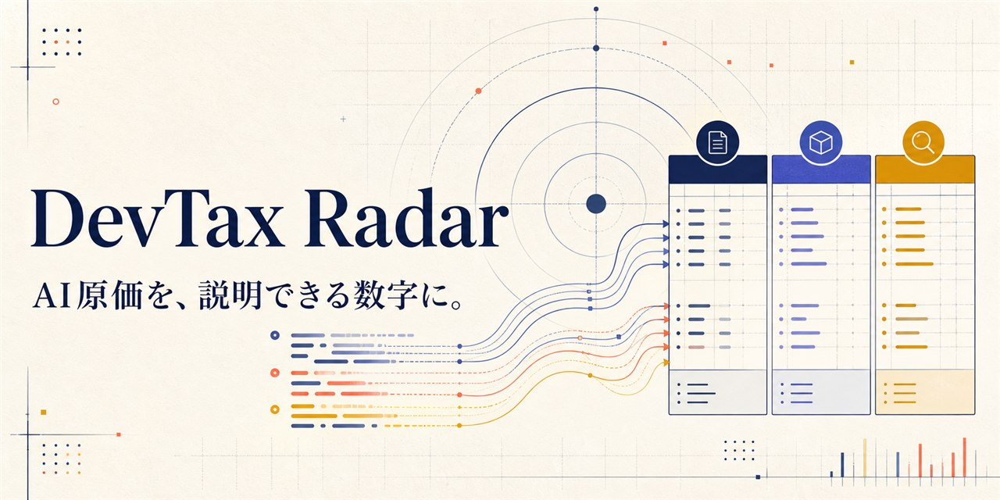

# DevTax Radar



> **Claude CodeとCodexの定額料金を、説明可能なプロダクト別AI原価へ。**

**[公開デモを試す](https://devtax-radar.pages.dev/)**（合成データのみ） ·
**[30秒の審査ガイド](./docs/JUDGING_GUIDE.md)** ·
**[ローカル版を起動する](#ローカルで起動)**

## 30秒でわかるDevTax Radar

**Problem — 定額AIサブスクは、どの資産をいくら作ったのか説明しにくい。**

Claude CodeやCodexを月額契約すると、同じ料金の中にProduct Aの新規開発、Product Bの機能追加、保守、一般学習、私用が混在します。API従量課金のようなプロダクト別請求額がないため、取得価額や資本的支出の検討に必要な、合理的で継続可能な配賦根拠を作るのが困難です。

**Solution — ローカル履歴を、月額と必ず一致する説明可能な配賦表へ変換する。**

DevTax RadarはClaude Code／Codexのローカル利用履歴から本文を保存せずに利用量を集計し、Provider別・月別・プロダクト別に定額料金を配賦します。その結果を、通常経費、新規ソフトウェア取得価額、資本的支出、制作原価、私用等の**税務処理候補**へつなぎます。

**Novelty — 時間計測でも、単純な「仕事60%」でもない。**

- Providerごとに異なるトークン定義を混ぜず、それぞれの月額を別の分母で配賦
- 入力、キャッシュ、出力、推論の利用量を重み付けし、プロダクトとの対応を保持
- Webチャットや別PCなど捕捉できない利用を「未取得利用」として明示的に留保
- 配賦額の合計が、私用・未取得利用・端数調整まで含めて請求額と必ず一致
- 結論を断定せず、適用ルール、判定理由、不足事実、確認要否まで返す

```text
ローカル履歴（本文は保存しない）
  → Provider別の加重利用量
  → 月額料金をプロダクトへ配賦
  → 開発段階・作業目的を確認
  → 3グループ表示
     今年の必要経費 / 翌年以後へ残る原価 / 対象外・要確認
  → 通常経費・取得価額・資本的支出・制作原価等の詳細候補
```

> **重要:** 本ツールが資産計上や節税を自動的に成立させるわけではありません。利用履歴から配賦根拠と検討材料を作り、利用者・税理士が事実関係を確認できる状態にするプロトタイプです。

## Why this should win

| 審査軸 | DevTax Radarが示すもの |
|---|---|
| **Impact** | 収益化前で支出が先行する個人開発者が、定額AI費用を「とりあえず全額当年費用」にせず、プロダクト別の検討材料を残せる |
| **Originality** | 定額AIサブスクの説明可能な配賦と、通常経費・取得価額・資本的支出等の税務候補を、一つの履歴から接続する |
| **Technical depth** | [Claude](./src/adapters/claude.ts)／[Codex](./src/adapters/codex.ts) Adapter、[Provider別分母と配賦不変条件](./src/core/allocation.ts)、SQLite、ローカルAPI、privacy checkを実装 |
| **Completeness** | [公開デモ](https://devtax-radar.pages.dev/)と実履歴を読むローカル版、複数月集計、3グループ表示、根拠ドリルダウン、テストまで一つの体験として動く |
| **Responsible design** | 税務判断を断定せず不足事実を返す。実履歴をクラウドへ送らず、公開版は完全な合成データだけを使う |
| **Future potential** | AI費用以外の共通費、CSV・会計連携、複数PC統合、税理士レビュー用エクスポートへ拡張できる証拠レイヤーになる |

3時間の制約下でも画面モックだけに留めず、履歴Adapter、決定的な配賦ロジック、税務候補エンジン、ローカル保存、セキュリティ境界、公開デモ、テストを接続しました。評価してほしいのは制作時間そのものではなく、**実在する痛みを、説明可能性とプライバシーを崩さず動く形まで落とした成果密度**です。

Global Build Week Community Event - Tokyoの3時間ハッカソンで制作したMVPです。履歴走査・配賦・ローカル保存・3画面UI・税務候補エンジンを実装済みですが、申告内容を確定する製品ではありません。イベントは[こちら](https://luma.com/uj22d2rs)です。

## 公開デモ

Cloudflare Pages版は、複数月の配賦と2段階の税務表示を体験できる**完全な合成データ専用デモ**です。実在するセッション、パス、プロンプト、請求額はアップロードしません。

**公開URL: [https://devtax-radar.pages.dev/](https://devtax-radar.pages.dev/)**

| | Cloudflare公開デモ | GitHub／Releaseのローカル版 |
|---|---|---|
| データ | 架空の複数月データのみ | 利用者自身のローカル履歴 |
| 履歴走査 | しない | read-onlyで走査 |
| 保存先 | デモ状態のみ | 端末内SQLite |
| 外部送信 | 実データを扱わない | telemetry・クラウド同期なし |
| 用途 | 審査・UI体験 | 実際の配賦記録づくり |

公開デモは閲覧・画面操作用です。自分のClaude Code／Codex履歴を走査する場合は、下記のローカル版を使用してください。

## ローカルで起動

必要環境は**Node.js 24.14以上**です。

```bash
git clone https://github.com/aobane-tsumugu/DevTaxRadar.git
cd DevTaxRadar
npm ci
npm run dev
```

起動後、`http://127.0.0.1:5173`を開きます。ローカルAPIは`127.0.0.1:4317`で動きます。

本番相当のローカル実行:

```bash
npm run build
npm start
```

GitHub ReleaseのZIPは依存関係をbundle済みです。Node.js 24.14以上を用意して展開し、ZIP内で次を実行します。`npm install`は不要です。

```bash
npm start
```

起動後、`http://127.0.0.1:4317`を開きます。

GitHubからソースまたはReleaseを取得し、各利用者のPCで使うことを配布の基本とします。利用者自身にCloudflareアカウントは不要です。

## デモ

1. 「設定を確認」からオンボーディングを開く
2. Claude Code／Codexを選んで履歴を走査する
3. 検出した作業フォルダをProduct A／B等へ割り当てる
4. Provider×月別の請求額と未取得利用率を保存する
5. 「今年どうなる？」で複数月の3グループ集計を見る
6. 「なぜそうなる？」で配賦額からProvider・月・プロジェクト集計までたどる
7. 「税務QA」で取得価額、資本的支出、旧版→新版、供用開始の考え方を確認する

APIへ接続できない静的プレビューでは、UI確認用の合成データへフォールバックします。実履歴はリポジトリ、Release、公開デモへ含めません。

## Cloudflareへデプロイ

メンテナーはCloudflareへログインしたPCで次を実行します。

```bash
npm ci
npm run deploy:cloudflare
```

このPagesプロジェクトはWranglerによるDirect Upload方式です。自動デプロイを追加する場合は、Cloudflareで`Cloudflare Pages: Edit`だけを対象アカウントへ許可したAPIトークンを作成し、GitHub ActionsのRepository secretsへ`CLOUDFLARE_API_TOKEN`と`CLOUDFLARE_ACCOUNT_ID`を登録します。秘密値をリポジトリやIssueへ記載しないでください。

## 実装済み

- `~/.claude/projects/**/*.jsonl`と`~/.codex/sessions/**/*.jsonl`のread-only走査
- 本文を正規化データへコピーしないClaude Code／Codex Adapter
- セッション、作業フォルダ、モデル、月、トークン内訳の正規化
- 識別子とパスの端末内saltによるハッシュ化
- ClaudeとCodexを別分母にした月額配賦
- Provider×月別に異なる請求額の入力・SQLite保存・配賦
- 入力、出力、キャッシュを区別した加重利用量
- 私用、未分類、未取得利用、丸め調整を含む配賦不変条件
- 複数月サマリー、詳細配賦、税務QAの3画面UI
- 月額、未取得利用率、プロダクト割当のSQLite保存
- 通常経費、取得価額、資本的支出、制作原価、私用等の決定木
- 10万円・20万円と青色申告者向け少額特例の条件ガイダンス
- loopback限定、Origin検査、CSRF token、64 KiB本文上限
- 合成fixture、ユニット・統合テスト、公開物のprivacy check
- Pull Request／`main` push時のGitHub Actions CI
- `v*`タグから、`npm install`不要のRelease ZIPを自動公開

主要実装:

- [Claude Code Adapter](./src/adapters/claude.ts)
- [Codex Adapter](./src/adapters/codex.ts)
- [定額料金の配賦](./src/core/allocation.ts)
- [税務候補の決定木](./src/core/taxDecision.ts)
- [資産金額境界](./src/core/assetThresholds.ts)
- [ローカルAPI](./src/server/index.ts)
- [プライバシー検査](./scripts/privacy-check.ts)

## 配賦方法

ClaudeとCodexではトークン定義が異なるため、生トークンをProvider間で合算しません。

```text
Provider月次配賦額
= Provider月額
× 対象プロダクトの加重利用量
÷ Provider内の配賦分母
```

各Providerの月額は、プロダクト、私用、未取得利用、丸め調整の合計と必ず一致します。未取得利用は、Webチャットや別PCなどローカル履歴で捕捉できない利用へ月額の一部を留保する仕組みです。

## 税務ガイダンスの範囲

画面では「今年の必要経費」「翌年以後へ残る原価」「対象外・要確認」の3グループに簡略化し、内部では通常経費、取得価額、資本的支出、制作原価、私用等を分けます。

10万円の境界は、月額サブスクの明細や1回の配賦額ごとに判定するものとして扱いません。直接対応する配賦額等を**資産単位で集計した取得価額**について、供用状況とあわせて処理候補を案内します。恣意的な資産分割や時期調整を勧める機能ではありません。

現在のルール実装は、次の事実を区別します。

- 10万円**未満**と、10万円以上20万円未満
- 青色申告者向け少額特例の新旧判定日は**取得・製作日**。供用開始日は減価償却等の別条件
- 同特例の対象は10万円以上で、年間上限300万円は事業月数で月割り
- 一括償却資産を選択した資産との重複適用不可
- 貸付用資産は、主要な事業として行う貸付け等を除いて対象外
- ソフトウェアの耐用年数候補は、複写販売用原本・研究開発用が3年、その他が5年

資本的支出については候補分類まで実装していますが、**当年の減価償却額はまだ算定しません**。耐用年数、償却方法、供用日等を不足情報として返します。

## プライバシー

履歴の読取、集計、分類、保存は利用者のPC内で完結します。

- サーバーは`127.0.0.1`だけで待受
- telemetry、クラウド同期、外部LLM送信なし
- プロンプト、応答、ソースコードを保存しない
- 元のセッションIDと絶対パスを保存しない
- SQLiteはOS標準のユーザーデータ領域へ保存
- 実ログ、DB、ホームパス、UUID等をprivacy checkで検査
- Release ZIPから実データ、fixture、ローカルDBを除外

詳細は[セキュリティ方針](./docs/SECURITY.md)を参照してください。

## テスト

```bash
npm test
npm run typecheck
npm run lint
npm run privacy:check
npm run build
```

テストはAdapter、配賦不変条件、税務候補、資産境界、SQLite、パス、セキュリティ、ローカルAPIを対象にしています。実ユーザー履歴ではなく合成fixtureと一時ディレクトリを使います。

## 現在の制約

- 税務ルールエンジンは実装済みですが、全ルールがダッシュボードUIへ接続済みではありません
- CSV出力、判定確定・修正、直接費入力、供用開始登録は未実装です。画面上でも開発中または注意表示にしています
- 資本的支出の当年償却額、制作原価、前払費用、旧版残価移転は未算定です
- 事業所得／雑所得、税額、申告内容、税務上の資産単位を自動確定しません
- Claude Code／Codexの履歴形式変更にはAdapter更新が必要です
- DB暗号化と複数PC同期は未実装です

本プロジェクトは、開発履歴と費用の整理、税務処理候補の説明を支援するプロトタイプです。税務相談や税理士業務を代替するものではありません。

コードは[MIT License](./LICENSE)で公開します。

## 設計資料

- [30秒の審査ガイド](./docs/JUDGING_GUIDE.md)
- [共有ペルソナに対する適合監査と改修候補](./docs/PERSONA_GAP_AUDIT.md)
- [統合プロダクト仕様](./PRODUCT_SPEC.md)
- [技術設計](./TECHNICAL_DESIGN.md)
- [セキュリティ方針](./docs/SECURITY.md)

## 国税庁公式資料

- [自己の製作に係るソフトウェアの取得価額等](https://www.nta.go.jp/law/tsutatsu/kihon/shotoku/08/06.htm)
- [資本的支出と修繕費等](https://www.nta.go.jp/law/tsutatsu/kihon/shotoku/05/07.htm)
- [減価償却のあらまし](https://www.nta.go.jp/taxes/shiraberu/taxanswer/shotoku/2100.htm)
- [資本的支出を行った場合の減価償却](https://www.nta.go.jp/taxes/shiraberu/taxanswer/shotoku/2107.htm)
- [少額減価償却資産・一括償却資産の所得税基本通達](https://www.nta.go.jp/law/tsutatsu/kihon/shotoku/08/12.htm)
- [ソフトウェアの取得価額と耐用年数](https://www.nta.go.jp/taxes/shiraberu/taxanswer/hojin/5461.htm)
- [令和8年度税制改正の大綱（抄）](https://www.nta.go.jp/publication/pamph/shotoku/0026004-015.pdf)
