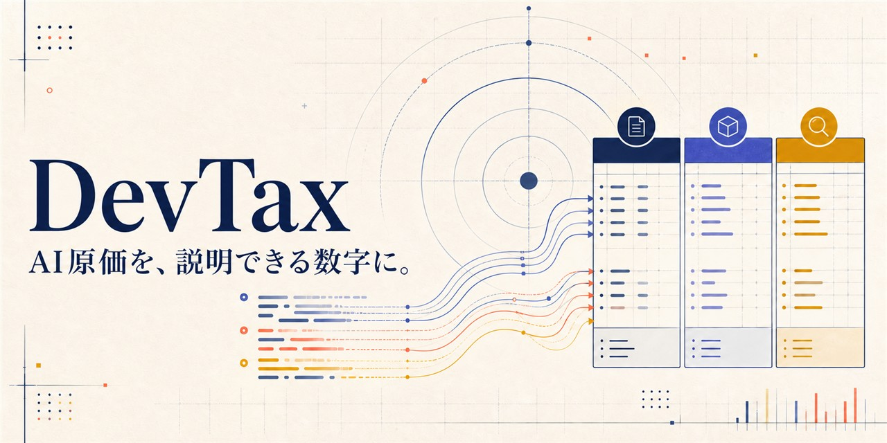

# DevTax



> **Claude CodeとCodexの定額料金を、説明できる制作物別AI原価へ。開発の早い段階から、あとで必要になる記録も案内します。**

> **開発中のプロトタイプです。** 機能は途中で、既知の不備があります。税務上の扱いを確定するものではありません。できないことは[まだできないこと](#まだできないこと)に、不具合の報告や要望は[Issues](https://github.com/aobane-tsumugu/DevTaxRadar/issues)へお願いします。

DevTaxの目的は、個人開発の実態に沿って費用・判断・根拠を積み上げ、今年の扱いと翌年への引継ぎを説明できるようにすることです。完成像は[製品仕様v0.5](./PRODUCT_SPEC.md)と[技術設計v0.5](./TECHNICAL_DESIGN.md)にあります。**仕様の採用と実装の完了は別です。** いまどこまで接続しているかは[要件・実装・受入対応表](./docs/design/requirements-matrix.md)、目的から現行コードまでの図解は[全体設計図](./docs/design/workflow-blueprint.html)で確認できます。

**[ローカル版を起動する](#ローカルで起動)** ·
**[画面だけ見る](#公開デモ)**（合成データのデモ） ·
**[開発に参加する](#開発に参加する)**

## 30秒でわかるDevTax

**困りごと — 定額AIサブスクは、どの制作物にいくら使ったのか説明しにくい。**

Claude CodeやCodexを月額契約すると、同じ料金の中にアプリAの新規開発、アプリBの機能追加、保守、一般学習、私用が混在します。API従量課金のような制作物別請求額がないため、取得価額や資本的支出の検討に必要な、合理的で続けられる振り分け根拠を作るのが困難です。

**解決方法 — このPCの履歴を、月額と必ず一致する説明可能な振り分け表へ変換し、次に残す記録を案内する。**

「今年どうなる？」は計画年の全費用の算定済み基礎と未算定件数を表示し、原額・配分の明細へつなぎます。AI内訳は対象年だけに絞り、全費用とは別に表示します。対応済みの取得価額・方法・年度額は「残高と繰越し」と年度資料へ接続し、未対応・不明な処理は未算定のまま分離します。

利用期間を指定したAI請求は、請求額が分からなくても理由を添えて登録できます。年をまたぐ不明額は関係する各年に残し、同期間の金額が分かる請求だけ計算を続けます。直接費・自宅費用・設備も原額の不明と0円を区別します。既定月額・月別上書き料金でも不明と0円を区別して理由を保存できます。月別の空欄は上書きなしなので、不明として残す場合は「料金不明」を選びます。

現在のDevTaxはClaude Code／Codexのローカル利用履歴から本文を保存せずに利用量を集計し、AIサービス別・期間別・制作物別に料金を配賦します。「支払と配分」ではAI料金・設備・家賃等・直接費を同じ費用資料へ正規化し、原額、対象年の費用基礎、制作物・通常業務・私用・未配分、未算定理由を確認できます。設備とソフトウェアの対応済み方法は、適用条件・取得価額・前年残高から年度額を計算し、残高と年度資料へ渡せます。特殊償却・未対応条件・不明額を通常計算へ置き換えず、未対応範囲として残します。

**特徴 — 時間計測でも、単純な「仕事60%」でもない。**

- AIサービスごとに異なるトークン定義を混ぜず、それぞれの月額を別の分母で配賦
- 入力、キャッシュ、出力、推論の利用量を重み付けし、プロダクトとの対応を保持
- 捕捉外の利用は確認した割合で留保。不明または利用基準がない支払は「配分未算定」として保持
- 配賦額の合計が、私用・未取得利用・端数調整・配分未算定額まで含めて請求額と必ず一致
- AI配賦の分類候補と、制作物・設備等の不足情報を表示。詳細な税務決定木の全ルールは画面へ未接続
- 初回の5段階案内で「何のための質問か」と入力の進み具合を表示し、途中保存できる
- 自分だけで使うアプリと、外部へ公開・販売するアプリの開始日を分けて記録できる

```text
ローカル履歴（本文は保存しない）
  → AIサービス別の加重利用量
  → 月額料金を制作物へ配賦
  → 開発段階・作業目的を確認
  → AI配賦に基づく3グループ表示

AI料金・制作物・設備・家賃・電気・通信・直接費・証拠
  → 原額 / 対象年の費用基礎 / 配分の共通計算
  → 支払と配分・根拠画面・作業中の相談用Markdown
  → 未算定の原額・理由・影響先を確認

v0.5の採用設計で引き続き接続するもの:
  全費用の入力・保存 → 事実に基づく処理候補
  → 当年費用・種類別残高 → 採用・翌期引継ぎ・訂正・完全出力
```

**想定している使い方**

Claude Code／Codexを使って個人開発している方を想定しています。複数PCを使う場合は、DevTaxを動かすPCから各PCの履歴フォルダをSMB/Samba等で読み取り可能にし、「はじめの準備」で走査元を追加します。各PCへのクライアント配置、常駐サービス、秘密鍵、手動インポートは不要です。

> **重要:** 本ツールが資産計上や節税を自動的に成立させるわけではありません。利用履歴から配賦根拠と検討材料を作り、利用者・税理士が事実関係を確認できる状態にするプロトタイプです。**何ができないかは[まだできないこと](#まだできないこと)にまとめています。使い始める前にお読みください。**

きっかけは3時間のハッカソンでしたが、そこで作ったMVPを継続して手を入れているOSSです。ライセンスは[MIT](./LICENSE)、Issueとプルリクエストを歓迎します。

## 公開デモ

画面の雰囲気だけを見たい場合のために、**合成データ専用のデモ**を置いています。実在する利用記録、パス、プロンプト、請求額は一切含みません。

**[https://devtax-radar.pages.dev/](https://devtax-radar.pages.dev/)**

デモは手動でデプロイしているため、`main`より遅れていることがあります。自分の履歴を実際に集計する場合は、下のローカル版を起動してください。デモでは「残高と繰越し」の入力と年度資料の保存を体験できません。3年にわたる取得価額・年額・繰越しの流れはローカル版で確認してください。

| | 公開デモ | ローカル版 |
|---|---|---|
| データ | 架空の合成データのみ | 利用者自身のローカル履歴 |
| 履歴走査 | しない | 読み取り専用で走査 |
| 保存先 | ブラウザを閉じると消える | 端末内SQLite |
| 更新 | 手動デプロイ | 取得したソースのcommitまたはReleaseのtag |

## ローカルで起動

必要環境は**Node.js 24.14以上**です。

```bash
git clone https://github.com/aobane-tsumugu/DevTaxRadar.git
cd DevTaxRadar
npm ci
npm run dev
```

起動後、`http://127.0.0.1:5173`を開きます。ローカルAPIは`127.0.0.1:4317`で動きます。

本番相当のローカル実行:

```bash
npm run build
npm start
```

[GitHub Releases](https://github.com/aobane-tsumugu/DevTaxRadar/releases)で配布するZIPは依存関係をbundle済みです。Node.js 24.14以上を用意して展開し、ZIP内で次を実行します。`npm install`は不要です。

```bash
npm start
```

起動後、`http://127.0.0.1:4317`を開きます。

GitHubからソースまたはReleaseを取得し、各利用者のPCで使うことを配布の基本とします。利用者自身にCloudflareアカウントは不要です。

このREADMEは現在のソースの説明です。`v0.1.0`は`9879d8e`時点の配布版で、後述のCodexアーカイブ走査・原本不在時の数値保持は含みません。これらは`main`へ取り込まれた変更です。次版の範囲と公開前の確認事項は[リリースノート候補](https://github.com/aobane-tsumugu/DevTaxRadar/blob/main/docs/RELEASE-v0.1.1.md)を参照してください。候補の記載だけでは、新版の公開や受入完了を意味しません。

### 以前のバージョンから更新する場合

メッセージ単位で保存していた古い開発版から更新する場合は、起動時に`usage_events`テーブルをセッション単位へ作り直すため、**履歴の再走査が必要**です。`v0.1.0`はすでにセッション単位の形式なので、今回のCodex数値保持の更新だけでこの再作成は行いません。フォルダに付けた期間付きの分類ルールも、旧形式のものは作り直されます。制作物（税務上の単位）と、設備・自宅費用・直接費・証拠の入力内容はそのまま残ります。

複数走査元に対応した版へ初めて更新するときは、DevTaxがDBの検証済みバックアップを作成してから、利用履歴とセッション参照へ走査元IDを付ける移行を行います。既定のローカル履歴の識別子は変更しません。

Codexの原本不在に対応した版への更新では、既存DBを検証付きでバックアップした後、数値キャッシュへ取得状態と不透明なセッション対応を追加します。セッション・制作物の識別子は変更しません。旧版ですでに集計から消えた未保持の数値を、この更新だけで復元することはできません。

配賦の帰属も変わりました。以前は月の判定をUTC基準で行っていたため、日本時間の午前9時より前の利用が前月へ入ることがありました。現在はPCのローカルタイムで判定します。再走査すると、月をまたぐ境界付近の配賦額が以前と変わる場合があります。

## ひととおりの流れ

1. 「はじめの準備」から、5段階の案内を開く
2. Claude Code／Codexの履歴を確認する。「履歴がいつ消えるかを確認する」を開くと、最も古い履歴と、Claude Codeの履歴が次に失われる推定日を確認できる。必要ならClaude Codeの保持日数をここで変更する
3. 「候補整理」で全履歴候補を確認し、同じ番号で制作物へまとめる。制作物の用途などを確認する
4. AI料金と契約期間、設備、家賃・電気・通信費、直接費と証拠を登録する
5. 診断で「現在地」「今すぐ確認すること」「出来事が起きたときに行うこと」を見る
6. 「フォルダの割当」で履歴フォルダを制作物・期間・分類へ結び付ける
7. 「今年どうなる？」で複数月の3グループ集計と準備の進み具合を見る
8. 「なぜそうなる？」で配賦、設備・自宅費用、金額保存則、証拠を確認し、相談用Markdownを出力する
9. 「税務QA」で取得価額、資本的支出、旧版→新版、実際に使い始めた日の考え方を確認する

ローカルAPIへ接続できない場合は、エラーと再読込操作を表示します。合成データへ自動的には切り替えません。ローカルの静的プレビューで合成デモを明示的に選ぶ場合は、URLに `?mode=demo` を付けます。実履歴はリポジトリ、Release、公開デモへ含めません。

## できること

### 履歴を読む

- `~/.claude/projects/**/*.jsonl`と、既定のCodex取得元では`~/.codex/sessions/**/*.jsonl`・兄弟フォルダ`~/.codex/archived_sessions/**/*.jsonl`を同じ取得元IDで読み取り専用走査。追加した取得元は指定したルートだけを走査し、兄弟フォルダを自動追加しない
- SMB/Samba、Windows共有、マウント済み共有等、DevTaxを動かすPCから通常のフォルダとして読める履歴を走査元に追加
- 起動時の自動走査と、画面からの再走査。走査元が一時的に読めない場合は前回の正常な集計を保持
- プロンプト・応答・ソースコードの本文を保存しないClaude Code／Codex Adapter
- セッション、作業フォルダ、モデル、月、トークン内訳の正規化
- 識別子とパスを、このPCの中だけで生成したsaltと走査元IDでハッシュ化し、別PCの同一IDを衝突させない
- 走査中のファイル数表示
- 履歴がいつ削除されるかの検出（`cleanupPeriodDays`、最も古い履歴の日付、次に失われる日）と、差し迫ったときの警告
- バックアップを取ったうえでの保持期間の変更（変更するのは`cleanupPeriodDays`だけ。日数は利用者が決め、製品は推奨値を出しません）
- このPCの既定履歴では、取り込み時のファイルSHA-256記録と、再走査時に内容が変わっていた件数の表示（走査直後の画面に出ます）。追加した共有走査元は、設定したルート絶対パスだけを設定として保存し、共有元内の各ファイル絶対パスやハッシュは保存しない。走査前後のサイズ・更新日時が一致したファイルだけを採用
- 走査時と現在のタイムゾーンが違う場合の警告（月の帰属が変わりうるため）

### Codexでアーカイブ・削除したあとの扱い

- 既定のCodex取得元は通常履歴とアーカイブを一緒に読みます。復元後の再接続でも、既定取得元のルート名が`sessions`の場合に限り兄弟`archived_sessions`を読みます。同じ取得元内の同一セッションは一つのコピーを採用し、移動・複製を合算しません。両方に残るときは現在見える通常履歴をアーカイブより優先し、同じ種類のコピーは更新日時、同値なら不透明ファイルキーで選びます。これは決定的な選択規則であり、コピーの正しさの証明ではありません
- 取り込み後に原本が見えなくなっても、取込済みの数値は通常の集計から消しません。最後まで走査した結果の「原本が見つからない」と、未接続・読み取り失敗は分けて表示します。削除・移動などの理由までは判定しません
- 原本を再び読めたセッションは現在の数値へ置き換えます。前回より小さい値も受け入れ、過去の値との加算や最大値の固定はしません。変更前の数値記録は別に残します
- 古いDBや再接続後など、保存済み集計とファイルの対応がない場合は「原本との対応未確認」として数値を保持します。削除されたのか未確認の場所に残っているのかは分からず、元にない期間別の詳細は作りません
- 保持状態は「はじめの準備」の走査結果、費用の来歴警告、保存した数値記録と出力へ残ります。走査完了は全履歴の取得や最新性を保証しません

保持するのは取り込めた数値と取得来歴です。会話本文のバックアップではなく、**取り込み前に削除された履歴は復元できません**。原本が必要なら利用者自身で別に保存してください。DevTaxの数値保持やDBバックアップは、税務上の証明・法定保存の適合を保証しません。

### 請求額を配賦する

- ClaudeとCodexを別の分母にして、それぞれの請求額を配賦
- 入力・出力・キャッシュを区別した加重利用量
- 利用開始日・終了日と実際の請求額を登録。年払い・年またぎ・月途中の請求を、両端を含む利用日数で月へ配分し、1円単位の端数調整後も請求額を保存
- プラン変更や再契約は、実際の請求と利用期間ごとに行を分けて入力。期間の重なり・同額同期間の請求は確認候補として表示し、自動統合や自動除外をしない
- 期間が分からない場合は、Provider×月の料金と既定月額を利用。サービス・月ごとに、期間付き請求、月別料金、既定月額の順に使い、同じ月へ重ねて加算しない
- 期間付き請求は利用日で履歴を選択。旧月額概算ではproviderごとの契約開始日・終了日で契約外の月とセッションを除外
- 配賦額の合計が、私用・未取得利用・丸め調整・配分未算定額まで含めて請求額と必ず一致することの検査

### 制作物へ結び付ける

- フォルダ×期間で登録した分類ルールを、各セッションの発生日時で解決
- 一致するルールがないフォルダは未分類のまま残す（勝手にどこかへ寄せない）
- セッションの最初の発言のプレビューと、作業フォルダへ`cd`してから再開するコマンドの生成
- 配賦明細からの分類変更

### 記録する

- 制作物、期間付き分類、自分利用開始・外部公開等の出来事を保存する台帳
- パソコン・GPU機器等の設備、家賃・電気・通信費、その他直接費、証拠の入力と保存
- 設備の当年償却費候補、業務割合、制作物割合と、自宅費用・直接費を合算する費用台帳
- 原額＝業務利用額＋私用、業務利用額＝制作物配賦＋未配賦を検査する金額保存則
- すべて端末内SQLiteへ保存

### 画面

- 今回確認すること、支払と配分、残高と繰越し、今年どうなる？、なぜそうなる？、フォルダの割当、PCとデータ、税務QAの8画面
- 「履歴→対象年→制作物→費用→診断」の5段階オンボーディングと途中保存
- 入力済み事実から現在地、今行うこと、将来の出来事で行うこと、不足情報を返す診断
- 10万円・20万円の金額境界の表示（青色申告者向け少額特例は、要件を別途確認する旨の注記のみ）
- AI料金が未入力のまま保存しようとした場合の確認と警告
- モーダルのフォーカストラップとEscapeキーでの終了
- 履歴・境界・明細・費用台帳が0件のときの、次に何をすればよいかの案内

### 出力する

- 税理士へ相談するときに使える、端末内の参照情報を除いたMarkdown出力

### 安全性

- `127.0.0.1`だけで待受、Hostヘッダ検査、Origin検査、CSRF token、64 KiB本文上限
- 合成fixtureによるユニット・統合テスト、公開物のprivacy check
- Pull Request／`main` push時のGitHub Actions CI
- `v*`タグから、`npm install`不要のRelease ZIPを自動公開

主要実装:

- [Claude Code Adapter](./src/adapters/claude.ts)
- [Codex Adapter](./src/adapters/codex.ts)
- [定額料金の配賦](./src/core/allocation.ts)
- [期間付き請求の月別配分](./src/core/chargePeriods.ts)
- [契約ごとの履歴範囲と捕捉外割合](./src/core/contractUsage.ts)
- [税務候補の決定木](./src/core/taxDecision.ts)
- [資産金額境界](./src/core/assetThresholds.ts)
- [現在地と次の行動の診断](./src/core/diagnosis.ts)
- [設備・自宅費用・直接費の共通費用計算](./src/core/workspaceCosts.ts)
- [診断・台帳のSQLite保存](./src/server/planningRepository.ts)
- [ローカルAPI](./src/server/index.ts)
- [履歴の保持期間の検出と変更](./src/server/retention.ts)
- [契約期間の判定](./src/server/contractPeriod.ts)
- [プライバシー検査](./scripts/privacy-check.ts)

## 保存と年度資料の仕組み

料金と計画は、途中保存も含めて一括保存します。古い画面からの保存は版番号で検出し、書込み・再計算の途中失敗は全体を元に戻します。競合時は変更前・この画面の入力・最新の保存内容を比較し、記録単位で残す側を選んで保存できます。最終保存と分類変更では、保存前に登録範囲の各年の費用基礎・配分・未算定理由を比較できます。確認中に入力や利用記録が変われば再確認を求めます。途中保存とブラウザ終了後の未送信入力復旧を分け、復旧だけでDB保存・本人確認を行いません。対応済みのソフトウェア・設備方法は年額と残高へ接続していますが、未対応の税務処理まで自動算定したとは扱いません。

「月次確認」では、制作物・対象年・検討した扱い・確認した扱い・根拠を判断記録として保存できます。本人が確認した記録は「残高と繰越し」の増減で選択でき、判断内容を編集すると未確認へ戻ります。種類別の期首・増減・期末を記録できますが、制作物・資料の存在と判断の確認状態・年・制作物の不一致を確認できます。費用・判断・残高を確認し、理由を添えて年度資料として保存できます。金額の由来・税務適用条件の検証完了を意味するものではありません。

「残高と繰越し」の保存済み年度資料一覧から、特定の保存版をMarkdownまたはJSONで持ち出せます。同じ一覧から、保存版と現在の保存入力・年次結果を比較し、金額に加えて根拠・判断・未算定の変更を確認できます。比較には画面の未保存入力を含めません。「保存済み各年への影響を確認」では、現在の記録で計算した各年の期首・期末と保存版との差、過年度訂正の未反映を確認できます。不明額や片方に記録がない残高は差額を未算定にします。Markdownにも全保存データを添付し、当時の資料がない旧版を現在の費用で補完しません。同じ年を保存し直すと元の資料を残した訂正版になります。保存済みDBと識別子のバックアップと復元は[データの保全と復元](#データの保全と復元)にまとめています。元ログ・証拠原本は別途保管してください。

残高の保存基盤は、作業中の入力・年度別計算・固定版読取のAPIを製品DBへ接続しています。既存DBへの残高表追加前には検証済みバックアップを作成します。期首・増減・振替は「残高と繰越し」から入力でき、費用・判断の参照を照合して年度資料として固定保存できます。対応済みのソフトウェア・設備方法は実際の年度額と残高へ接続し、未対応・不明な税務処理は未算定のまま区別します。

## 利用者のファイルへ書き込む場所

DevTaxが自分のデータフォルダの外へ書き込むのは、画面から明示的に操作したときの次の2種類だけです。

- `~/.claude/settings.json`の`cleanupPeriodDays`（履歴の保持日数）
- 「PCとデータ」で指定した**新しい**バックアップ先・復元先フォルダ

履歴ファイルそのものは読み取りのみで、書き込み・移動・削除は一切しません。設定ファイルの書き換えの前には上書きされない控えを取り、一時ファイルへ書いてから置き換えるため、途中で失敗しても元のファイルは残ります。JSONとして解析できない場合は書き換えません。バックアップ先・復元先は存在しないフォルダだけを受け付け、既存のファイルを上書きしません。詳細は[セキュリティ方針](./docs/SECURITY.md)にあります。

## まだできないこと

使い始める前に知っておいてほしい制約です。「いずれ対応したい」ではなく「いま対応していない」ことだけを書いています。

### 共有フォルダは利用者が準備します

複数PCの統合では、DevTaxを動かす1台から他のPCのClaude Code／Codex履歴フォルダを読める状態が必要です。DevTax自身はSMB/Sambaの共有作成、OS資格情報の管理、共有先PCの起動、VPN接続を行いません。共有先が停止中・未接続・権限不足の場合、その走査元だけを更新せず、前回の正常な集計を保持します。

画面の「PCとデータ」では、複数PCの履歴を1台へ集約する作業と、DevTaxの保存データ自体を別PCへ引っ越す作業を分けて案内します。ローカル版では、検証付きDB全体バックアップの作成、bundle検証、新規データフォルダへの復元を画面から実行できます。復元は現在のデータを上書きせず、復元先で起動した後に既存の再接続画面でsource rootを確認します。クラウド同期・複数PCからの同時編集は行いません。

共有が使えない環境向けのCollectorは現時点では実装していません。将来の代替経路であり、通常構成の前提ではありません。

### 取り込み前に消えた履歴・会話本文は取り戻せません

Claude Codeは、`~/.claude/settings.json`の`cleanupPeriodDays`を過ぎた履歴を削除します。このキーは既定では設定されておらず、その場合は30日です。**既定のまま使っていた場合、1か月より前の記録はすでに失われている可能性が高いです。** 本ツールはその状況を検出して知らせ、日数の変更もできますが、消えたものを取り戻すことはできません。

残っている制約は次のとおりです。

- 延長できるのはClaude Codeだけです。DevTaxはCodexの保持期間設定を変更しません。Codexの最古日表示は通常履歴フォルダを対象とし、アーカイブを含む取得範囲の完全性や削除予定日を示すものではありません
- 「次に失われる日」は**推定**です。最も古いファイルの更新日時に保持日数を足して計算しています。Claude Codeが実際に何を基準に削除しているか、いつ削除を実行するかは公開されていません。削除はClaude Codeの起動時に行われるようなので、しばらく起動していなければ、推定日を過ぎていてもまだ残っていることがあります
- 日数を変更するとき、書き戻しは`JSON.stringify`で行うため、利用者が付けていたインデントやキーの並びは保たれません。変更前のファイルは同じ場所へバックアップしますが、**バックアップは自動で消しません**。溜まっていきます
- Claude Code自身も同じ設定ファイルを書きます。読み取りと書き込みの間に書かれた変更は、上書きされる可能性があります
- このPCの既定履歴では、取り込み時にファイルのSHA-256を記録し、再走査で変わっていれば件数を知らせます。ただしこれは**同じPC内で記録の辻褄が合っていることを示すだけ**で、第三者に対する改ざん防止にはなりません。同じ利用者権限で動く以上、ハッシュ自体も書き換えられます。また、同じセッションを続ければ履歴ファイルは当然変わるため、件数が0でないこと自体は異常ではありません。追加した共有走査元では元ファイルのパスとハッシュを保存しません

### 料金入力の範囲と残る制約

- **年払い・日割り**：「請求・契約履歴」へ利用期間と実際の請求額を入れると、年払いを含む原額を日数比で月へ配分できます。事業者の請求額・割引・返金を自動計算する機能ではありません。旧月額概算の契約開始月・終了月は日割りせず満額です
- **プラン変更・再契約**：請求ごとの期間を複数登録できます。差額は明細にある実際の請求額を手入力します。旧月額概算の契約期間はproviderごとに開始日・終了日の1組だけです
- **同月の一部だけを覆う請求**：その月は期間付き請求を優先し、残りの日を月額概算で自動補完しません。請求に対応する利用期間を確認してください
- **内税・外税の区別**：入力した金額をそのまま使います。消費税の扱いは分けていません
- **領収書の取り込み**：金額はすべて手入力です。領収書は「どこに置いたか」のメモとして参照先を記録できるだけで、ファイルの中身は読みません
- **為替**：ドル建てで払っている場合、円換算額を利用者が入力します

### 割り当てまわりで対応していないこと

- **1つのフォルダは、ある期間について1つの制作物**にしか結び付けられません。1つのリポジトリの中で複数の制作物を並行して作っている場合、フォルダを分けない限り区別できません
- **捕捉外の利用量を自動計測する機能はありません**。割合は手入力で、空欄は不明、0%は捕捉外なし、正の値は推定です。請求の契約対応に、取得元・フォルダ・会話・期間で選ぶ履歴範囲、捕捉外割合、根拠を保存できます。「請求・契約履歴」の各請求から編集でき、重複や期間の重なりがない単独請求にも指定できます。固有範囲がない単一契約は既存の取得範囲・共通割合を使い、その期間の確認済み事実とは扱いません
- **履歴範囲の曖昧さは推測で埋めません**。別契約に同じ利用記録が重複する場合、利用時点が不明な場合、集計期間が選択期間の境界をまたぐ場合などは、原額を配分未算定として残します。請求額の日数配分ができても、履歴の利用量を機械的に日割りすることはありません
- **gitのブランチ・コミットは取得しません**。どのブランチでの作業かは配賦の根拠に使えません
- **セッションのモデル名は、そのセッションの最初のメッセージの値で固定**されます。途中でモデルを切り替えても反映されません

### 時刻まわりの注意

月の帰属は、**DevTaxを動かして走査したPCのタイムゾーン設定**で判定します。走査時からタイムゾーンが変わった場合は警告します。海外へ移動してタイムゾーンを変えたあとに再走査すると、月末・月初の利用の帰属が変わる可能性があります。

### 税務の計算で確定しないこと

- 税務候補の決定木（`src/core/taxDecision.ts`）は、対象年の処理条件を登録した費用配分に限り、共通費用計算（`/api/projections`・`/api/dashboard`）から呼び、費用画面に条件付きの候補として出します。採用済みの費用・残高へ自動記帳はしません。それ以外の画面に出る税務候補は、配賦時の分類と資産の状態から組み立てています
- 金額境界の案内（`src/core/assetThresholds.ts`）は関数として実装しテスト済みですが、**画面とAPIの経路からはまだ呼んでいません**
- 設備は当年償却費の**候補額**を計算しますが、資本的支出、制作原価、前払費用、旧版残価移転の最終的な償却額は算定しません
- 事業所得／雑所得の区分、税額、申告内容、税務上の資産単位を自動で確定しません
- 交通費、通信契約の複数回線按分、暗号資産等との所得集計は扱いません

### そのほか

- **証拠ファイル本体は取り込みません**。端末内の参照先とメモだけを保存します
- **CSV出力は未実装**です。Markdown出力はあります
- 判断記録は画面で追加・本人確認・修正できます。対応済みのソフトウェア年額判断は保存済み方法から構造化して作り、内部候補名を再入力しません。すべての税務判断を自動確定する機能ではありません。
- **DBの暗号化はありません**。OS標準のユーザーデータ領域に平文のSQLiteとして置きます
- Claude Code／Codexが履歴の形式を変えた場合、Adapterの更新が必要です
- 動作確認はWindowsが中心です。macOS・Linuxのパス解決は実装していますが、実機での確認は限定的です

本プロジェクトは、開発履歴と費用の整理、税務処理候補の説明を支援するプロトタイプです。税務相談や税理士業務を代替するものではありません。最終的な判断は、必ず税理士等の専門家へご相談ください。

## 配賦方法

ClaudeとCodexではトークン定義が異なるため、生トークンをProvider間で合算しません。

```text
AIサービス月次配賦額
= AIサービス月額
× 対象プロダクトの加重利用量
÷ AIサービス内の配賦分母
```

各AIサービスの月額は、制作物、私用、未取得利用、丸め調整、配分未算定額の合計と必ず一致します。未取得利用は、取得した履歴に含まれない利用へ、入力された割合で額を留保する仕組みです。割合が不明、または配分に使える利用基準がない場合は、支払全体を配分未算定として保持します。全額が捕捉外の利用であると判断したものではありません。新規設定に10%や25%を置かず、保存済みの割合は既存値として保持します。

## 税務ガイダンスの範囲

画面では「今年の必要経費」「翌年以後へ残る原価」「対象外・要確認」の3グループに簡略化し、内部では通常経費、取得価額、資本的支出、制作原価、私用等を分けます。

10万円の境界は、月額サブスクの明細や1回の配賦額ごとに判定するものとして扱いません。直接対応する配賦額等を**資産単位で集計した取得価額**について、供用状況とあわせて処理候補を案内します。恣意的な資産分割や時期調整を勧める機能ではありません。

次の事実の区別は`src/core/assetThresholds.ts`にルールとして実装し、テストしています。ただし「現在の制約」に書いたとおり、この関数は画面とAPIの経路からはまだ呼んでいません。画面に出るのは10万円・20万円の境界表示までです。

- 10万円**未満**と、10万円以上20万円未満
- 青色申告者向け少額特例の新旧判定日は**取得・製作日**。供用開始日は減価償却等の別条件
- 同特例の対象は10万円以上で、年間上限300万円は事業月数で月割り
- 一括償却資産を選択した資産との重複適用不可
- 貸付用資産は、主要な事業として行う貸付け等を除いて対象外
- ソフトウェアの耐用年数候補は、複写販売用原本・研究開発用が3年、その他が5年

設備は、登録した取得価額または私用から転用した時点の未償却残高、耐用年数、利用月数、業務割合、制作物割合から**当年償却費の候補額**を台帳へ計算します。これは申告額の確定ではありません。耐用年数や転用時残高が分からないときは推測せず、不足情報と未配賦額として残します。資本的支出、制作原価、前払費用、旧版残価移転の最終的な税務処理と償却額は算定しません。

## プライバシー

履歴の読取、集計、分類、保存は利用者のPC内で完結します。

- サーバーは`127.0.0.1`だけで待受
- telemetry、クラウド同期、外部LLM送信なし
- プロンプト、応答、ソースコードを保存しない
- 元のセッションIDと絶対パスは、隔離した`session_references`テーブルにだけ置き、APIの応答・画面・Markdown出力のいずれにも出さない
- このPCの既定履歴のファイルハッシュも同じテーブルの中だけで扱い、外へ出るのは「変わった件数」だけ。追加した共有走査元のファイルハッシュは保存しない
- 明示的に「内容を確認」を押した場合だけ、このPCの既定履歴の元ファイルから先頭プロンプトの短いプレビューを返す。DBへは保存せず、追加した共有走査元では利用できない
- SQLiteはOS標準のユーザーデータ領域へ保存
- 実ログ、DB、ホームパス、UUID等をprivacy checkで検査
- Release ZIPから実データ、fixture、ローカルDBを除外

詳細は[セキュリティ方針](./docs/SECURITY.md)を参照してください。

## データの保全と復元

いちばん簡単なのは、画面の「PCとデータ」から操作する方法です。検証付きのバックアップ作成、バックアップの検証、新しいフォルダへの復元ができます。復元は現在のデータを上書きしません。コマンドで行う場合は次のとおりです。

### DB全体のバックアップ（ソース環境）

年度資料のMarkdown/JSONとは別に、DB全体と識別子設定を新しいフォルダへ取り出せます。保存先は存在しないフォルダを指定してください。

```powershell
node --import tsx scripts/data-backup.ts create "C:\path\to\DevTaxRadar" "D:\backup\DevTax-2026-09-08"
node --import tsx scripts/data-backup.ts verify "D:\backup\DevTax-2026-09-08"
```

保存内容はSQLiteの一貫したsnapshot、identifier-salt、ファイルhash・schema hashを含むmanifest、説明文です。採用履歴、作業中の保存済み入力、数値観測、source設定、証拠参照、自由記述を含みます。元ログ・証拠原本・外部アプリ設定・画面の未保存入力は含みません。相談相手へ渡す資料とは保存範囲が異なります。

作成・検証・新規フォルダへの復元CLIを接続しています。復元直後は走査を停止し、保存済み資料を確認できます。履歴フォルダの再接続と保留解除は下記CLIで行えます。復元後の再接続は画面からも操作できます。配布版にもbackup/restoreと再接続コマンドを同梱しています。既存データの上書き復元や未対応schemaの読み捨ては行いません。
復元する場合は、新しいデータフォルダを指定します。現在の実行版で作成した空DBのschemaと一致することを確認してから展開します。

```powershell
node --import tsx scripts/data-backup.ts restore "D:\backup\DevTax-2026-09-08" "C:\DevTax-Restored"
$env:DEVTAX_RADAR_DATA_DIR = "C:\DevTax-Restored"
node --import tsx src/server/index.ts
```

復元先では元のsource ID・rootと識別子設定を保持します。画面に復元確認中と表示し、自動走査と手動走査を止めます。再接続前は保存済み資料の確認に使用してください。走査を再開するために保護ファイルを手動削除する操作は、正式な再接続経路ではありません。
復元後の再接続は次の順序で行います。

```powershell
node --import tsx scripts/restore-sources.ts preview "C:\DevTax-Restored" "C:\restore-sources-plan.json"
```

生成されたJSONのsourceId・version・baseHashを維持し、sourcesの各rootとenabledを編集します。同じ元履歴を置いたフォルダをrootへ指定し、読めない・今は走査しない読み取り元はenabledをfalseにします。すべての読み取り元を一度ずつ残してください。元の履歴と同一であることは利用者が確認する必要があります。

```powershell
node --import tsx scripts/restore-sources.ts apply "C:\DevTax-Restored" "C:\restore-sources-plan.json"
```

接続先と走査対象を一括保存して保留を解除します。このコマンド自体では走査しません。起動中の画面は再読込後に「月次確認」から手動走査できます。再起動時は通常の自動走査設定に従います。元のsource ID・識別子・数値資料は維持し、接続先が変わった読み取り元のキャッシュだけを無効化します。確認後に設定が変わった場合は、別名の計画ファイルをpreviewで作り直してください。
復元後のアプリ画面では「復元した読み取り元を確認」を押すと接続先を編集できます。同じ元履歴のフォルダを指定するか、原本がない読み取り元を走査対象から外し、確認チェックを付けて保存してください。保存後に保留が解除されますが、この操作だけでは走査を開始しません。競合時は入力を保持し、最新情報を読み直すときも以前の入力を控えとして表示します。

### Release配布版でのバックアップと復元

Release ZIPを展開したフォルダで、Node.js 24.14以降を使って実行します。npm installやソース環境のtsxは不要です。Windowsの標準保存先は `$env:LOCALAPPDATA\DevTaxRadar`、`DEVTAX_RADAR_DATA_DIR` を指定している場合はそのフォルダです。パスは引用符で囲んでください。

```powershell
npm run data:backup -- create "$env:LOCALAPPDATA\DevTaxRadar" "D:\backup\DevTax-copy"
npm run data:backup -- verify "D:\backup\DevTax-copy"
npm run data:backup -- restore "D:\backup\DevTax-copy" "C:\DevTax-Restored"
$env:DEVTAX_RADAR_DATA_DIR = "C:\DevTax-Restored"
npm start
```

復元先は新規フォルダを指定します。既存のDevTaxを終了してから復元先を指定して起動し、画面の「復元した読み取り元を確認」で接続先と走査対象を確認してください。環境変数の上記設定は現在のPowerShellにだけ適用されます。以後の起動時も同じ保存先を指定してください。

CLIで再接続する場合は `npm run data:reconnect -- preview "C:\DevTax-Restored" "C:\reconnect-plan.json"` で計画を作成し、前節と同じ要領でroot/enabledを編集して `npm run data:reconnect -- apply "C:\DevTax-Restored" "C:\reconnect-plan.json"` を実行します。

バックアップは保存済みDBと識別子を含みます。元ログ、証拠原本、外部アプリ設定、ブラウザの未保存入力は含みません。接続先パスや自由記述を含む私的資料なので、相談相手へ渡す年度資料とは別に保管してください。

## 画面操作の補足

### 費用と残高増加の金額を対応付ける

「残高と繰越し」の増加記録にある「この年の費用配分を確認」から、同じ制作物への最終配分を選び、対応額を入力できます。保存後に「保存する年度資料を確認」を押すと、増加額・対応額・未対応額と、費用配分ごとの指定額・未使用額を確認できます。

同じ配分を複数年・複数残高へ重ねて使い、合計が配分額を超える場合は年度資料の採用を拒否します。未対応分は自動で埋めず、未対応の状態を明示した資料として保存できます。振替は元の費用を再消費しません。この照合は増加額と費用配分の数量対応を扱い、期首の由来、費用化・振替後の個別原価、税務上の適用条件の確認は継続課題です。

### ブラウザを閉じた後の残高入力

残高画面の編集は、このブラウザに復旧用の控えを作ります。再度同じ接続先を開き、「復旧できる入力を確認」から対象の全内容を確認して復旧してください。別画面で保存済み資料が変わっていた場合は比較画面へ進みます。復旧だけでDBへ上書き保存したり、年度資料を採用したりはしません。

控えの保存に失敗した場合は警告が出ます。画面の入力は残っていますが、閉じる前に作業中の残高を保存してください。残高、料金・計画、費用処理条件、ソフト方法、判断記録の対応済み編集画面は未送信入力を同じブラウザで復旧できます。控えはブラウザのデータ削除や別PCへの移行では引き継がれず、DBバックアップにも含まれません。

### 年度資料の保存結果が分からないとき

「残高と繰越し」の「前回の保存要求を確認」で、このブラウザに控えた要求を確認できます。「同じ保存要求を再試行」は、保存済みなら元の資料を表示し、未保存なら確認時の資料と現在の内容が一致する場合だけ保存します。版の変更が通知されたら、年度資料を確認し直してください。

要求は送信前に同じブラウザ・接続先へ控えます。控えを保存できない場合は送信せず通知します。控えの削除は年度資料を取り消しません。送信前の理由入力や資料全体のバックアップではなく、ブラウザのデータ削除や別PCへの移行では引き継がれません。

### 料金・計画の未保存入力を戻す

入力画面の「料金・計画の控えを確認」で、前回の編集中入力を確認し、復旧できます。途中の日付、金額不明、候補の整理も控えます。別の入力が編集中なら、保存するか画面を閉じて開き直してから復旧してください。復旧しただけではDBを変更せず、保存時に最新との比較を行います。

控えは編集後に同じブラウザ・接続先へ記録します。記録できない場合は通知します。別PCへの移行やDBバックアップには含まれません。履歴の接続設定フォームや保持日数、未確定の比較選択は対象外です。

### 対応額の元の支払を確認する

「支払と配分」の「この金額はどこから来たか」で、確認したい対応額または未算定項目を選びます。元の支払、期間別の計算方法、中間の配分、最終対応先を参照順に確認できます。各段階の金額は同じお金を含むため、足し合わせません。証拠は参照IDを示し、原本を確認済みとは扱いません。

## 開発に参加する

Issueとプルリクエストを歓迎します。手順と約束ごとは[CONTRIBUTING.md](./CONTRIBUTING.md)にまとめています。変更を送る前に、次を順に実行してください（Node.js 24.14以上）。

```bash
npm ci
npm run docs:check
npm run typecheck
npm test
npm run lint
npm run format:check
npm run build
npm run privacy:check
npm run release:pack
```

`format:check`も必須の品質ゲートです。対象は`src/**/*.{ts,tsx,css}`、`tests/**/*.ts`、`scripts/*.ts`で、Markdownや`tests/**/*.tsx`を含む全ファイルの整形を保証するものではありません。失敗した場合は差分を確認して整形し、変更後に再実行してください。既存の未整形を理由に失敗を許容する運用は終了しています。

テストはAdapter、配賦不変条件、契約期間、税務候補、資産境界、診断、費用台帳、SQLiteとその移行、履歴の保持期間と設定ファイルの書き換え、取り込み時のハッシュ、パス、セキュリティ、ローカルAPI、クライアントの入力ガードとフォーカストラップを対象にしています。実ユーザー履歴ではなく合成fixtureと一時ディレクトリを使います。設定ファイルの書き換えを試すテストは、必ず一時ディレクトリのコピーを対象にします。

## ライセンス

コードは[MIT License](./LICENSE)で公開します。

## 設計資料

- [統合プロダクト仕様](./PRODUCT_SPEC.md)
- [技術設計](./TECHNICAL_DESIGN.md)
- [セッション単位の帰属と履歴保全 設計](./docs/design/session-attribution-and-retention.md) — 保存形式をメッセージ単位からセッション単位へ作り直した経緯と、フォルダの割当・契約期間・履歴保全の設計
- [セキュリティ方針](./docs/SECURITY.md)
- [メンテナー向けの手順](./docs/MAINTAINING.md) — 公開デモのデプロイとリリース

## 国税庁公式資料

- [自己の製作に係るソフトウェアの取得価額等](https://www.nta.go.jp/law/tsutatsu/kihon/shotoku/08/06.htm)
- [資本的支出と修繕費等](https://www.nta.go.jp/law/tsutatsu/kihon/shotoku/05/07.htm)
- [減価償却のあらまし](https://www.nta.go.jp/taxes/shiraberu/taxanswer/shotoku/2100.htm)
- [資本的支出を行った場合の減価償却](https://www.nta.go.jp/taxes/shiraberu/taxanswer/shotoku/2107.htm)
- [少額減価償却資産・一括償却資産の所得税基本通達](https://www.nta.go.jp/law/tsutatsu/kihon/shotoku/08/12.htm)
- [ソフトウェアの取得価額と耐用年数](https://www.nta.go.jp/taxes/shiraberu/taxanswer/hojin/5461.htm)
- [令和8年度税制改正の大綱（抄）](https://www.nta.go.jp/publication/pamph/shotoku/0026004-015.pdf)
